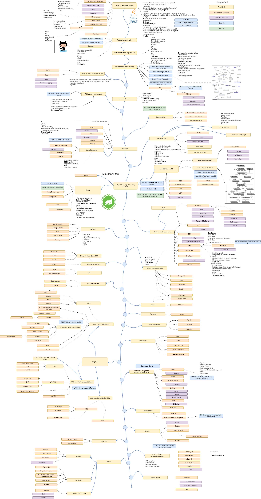

# JTechLog Java Roadmap

Java technology roadmap or learning path

## Bevezető

Manapság divatosak az un. _roadmapek_, térképek, melyek grafikusan ábrázolják, hogy miket kell megtanulnod ahhoz, hogy
egy területen otthonosan mozogj, hogyan kezdj neki a tanulásnak, hogy végül magas szinten meg tudd oldani a 
felmerülő problémákat.

Ezek közül a legismertebb a [Web Developer Roadmap - 2019](https://github.com/kamranahmedse/developer-roadmap),
mely még a [Front-end Developer Handbook 2019](https://frontendmasters.com/books/front-end-handbook/2019/)
könyvben is helyet kapott.

Ez látva én is elhatároztam, hogy készítek egyet a Java Platform területén, mely több okból is hasznomra válhat:

* Rendszerezem a meglévő szabványokat, technológiákat, eszközöket
* Aki már járatos a témában, az is találhat rajta újdonságokat
* Oktatás során többször kérdezik tőlem, hogyan érdemes nekiállni a Java tanulásnak, így kész válaszom lehet
* Magam számára is ad egy eligazítást, hogy mivel érdemes foglalkozni, amiről esetleg hasznos lenne blog posztot írni, vagy tanfolyamot
  kidolgozni
* Egy helyre összegyűjthetem a legjobb könyveket és referenciákat
* Elindít egyfajta kommunikációt

A felépítése a szokásos, felülről lefelé kell haladni. A fő ágon vannak a kötelező elemek, és erről ágaznak
el az opcionális elemek. A témakörök sárgával vannak jelölve, a szabványok, technológiák és eszközök narancssárgával,
a könyvek kékkel.

Lilával jelöltem azokat az elemeket, melyek hasonló problémákat oldanak meg, mint a narancssárgával
jelöltek, én mégis a narancssárgák használatát javaslom. Vigyázat, ez nagyon szubjektív lehet, lehet, hogy bizonyos
környezetekben pont a lila a megfelelő (vagy az egyetlen lehetséges) választás. A preferencia oka főleg a
szélesebbkörű elterjedtség, aktívabb közösség, fejlődés, egyszerűség, tanulhatóság és tesztelhetőség.
A térképen lévő egyik eszközzel sem lehet nagyon melléfogni, általában széleskörűen használt megoldások.

A térkép szándékosan nem tér ki a következő területekre: virtualizáció, cloud computing, big data, microservice. Ezek
elegendő anyagot biztosítanak egy külön roadmap felrajzolásához.

A roadmap fejlesztése ezennel nem állt meg, folyamatosan szeretném bővíteni, magyarázni. Valamint szöveges
leírásokat is tervezek készíteni a roadmapen lévő alterületekkel kapcsolatban. Ezekhez várok minden visszajelzést.

Bár a térkép magyar nyelven készült, egy idő után, amennyiben kicsit stabilizálódik, tervezem angol nyelvre is lefordítani.

viczian.istvan a gmail-en

## Roadmap



## Rövidítések

```
AOP = Aspect-Oriented Programming
API = Application Programming Interface
BDD = Behavior-Driven Development
CDI = Context and Dependency Injection
CGLIB = Code Generation Library
DIP = The Dependency Inversion Principline
DOM = Document Object Model
DRY = Don’t Repeat Yourself
E2E = End-To-End
EJB = Enterprise JavaBeans
F.I.R.S.T = Fast + Isolated + Repeatable + Self-checking + Timely
GSON = Java API from Google, converting Java objects to JSON, and vice-versa
HTTPS/TLS = Hypertext Transfer Protocol Secure/Transport Layer Security
ISP = The Interface Segregation Principline
JAXB = Java Architecture for XML Binding
JAX-RS = Java API for RESTful Web Services
JAX-WS = Java API for XML Web Services
JCP = Java Community Process
JDBC = Java Database Connectivity
JJWT = JSON Web Token for Java and Android
JMS = Java Message Service
JNDI = Java Naming and Directory Interface
JPA = Java Persitence API
JPQL = Java Persistence Query Language
JSF = Java Server Faces
JSON = JavaScript Object Notation
JSON-P = JSON Processing
JSP = JavaServer Pages
JSR = Java Specification Request
JSTL = JSP Standard Tag Library
JVM = Java Virtual Machine
JWT = JSON Web Token
KISS = Keep It Simple, Stupid
LSP = The Liskov Substitution Principline
MOM = Message-oriented middleware
MVC = Modell + View + Controller
OCP = The Open Closed Principline
OSGi = Open Services Gateway initiative
PKI = Public Key Infrastructure
REST = Representational State Transfer
SOAP = Simple Object Access Protocol
S.O.L.I.D = SRP + OCP + LSP + ISP + DIP
SRP = The Single Responsibility Principline
TDD = Test Driven Development
WSDL = Web Services Description Language
XML = Extensible Markup Language
YAGNI = You Ain’t Gonna Need It
```

## Készítés menete

A roadmap a [draw.io](http://www.draw.io) eszközzel készült.
